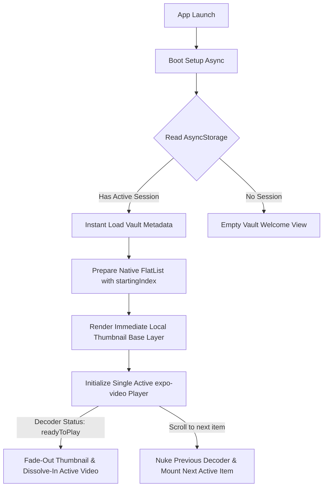

# 🎬 OffReel — Immersive Offline Video Vault & Feed

[](https://expo.dev/)
[](https://reactnative.dev/)
[](https://docs.expo.dev/versions/unreleased/sdk/video/)
[](https://opensource.org/licenses/MIT)

**OffReel** is a premium, offline-first native media client that elevates your local phone gallery into an immersive, zero-latency vertical video feed. Inspired by modern short-form video interactions (like TikTok and Instagram Reels), OffReel combines hardware-accelerated rendering, smart cache mechanisms, and fluid micro-interactions to create a cinematic viewing experience for your personal offline video archive.

Developed with **Expo (SDK 54)** and powered by the cutting-edge, next-generation **`expo-video`** module, OffReel achieves desktop-grade scrolling performance and raw native playback directly on mobile hardware.

---

## ✨ Core Features & Visual Highlights

- **🎬 Vertical Reels-Style Feed:** Effortless snap-to-position vertical scrolling that mimics premium social apps, custom-tailored for raw video assets in your camera roll.
- **⚡ Single Hardware Decoder Isolation:** Extremely robust viewport tracking guarantees that exactly *one* video decoder is active at any time, preventing memory exhaustion and keeping device temperature cool.
- **🔄 Dual Sync-Engine Paradigm:** 
  - *Live OS Gallery (Auto-Sync):* Intelligently scans and syncs media library updates in a non-blocking background thread.
  - *Custom Vault (Manual Mode):* Allows absolute manual curate selection of local files through an interactive visual grid containing safety locks for already-ingested files.
- **🌅 Fade-In "Dissolve" Poster Transitions:** Pre-loads a highly optimized native thumbnail representing the video's first frame, fading the hardware video layer in dynamically (150ms duration) once fully buffered, hiding latency entirely.
- **🚀 Session Restoration (Instant Resume):** Automatically remembers your active scroll position, default zoom settings, and sync preferences using AsyncStorage. Booting into your last-viewed video takes less than a second!
- **💖 Interactive Gestures & Micro-Animations:**
  - *Double-Tap Like:* Dynamic visual feedback throwing a custom spring-physics heart burst on the precise tap coordinates, coupled with physical haptic response.
  - *Single-Tap Pause/Play:* Smooth scale animations and instant action overlay.
- **🍸 Glassmorphic Floating Hub:** Blended translucent floating action pill containing immediate access to Native Shares, Vault Metadata Sheets, and Favorites.
- **💎 Premium Shimmer Skeletons:** A gorgeous hardware-accelerated shimmer screen reflecting active layout calculations when permissions or media caches boot.

---

## 🛠 Tech Stack

| Technology | Purpose | Key Module / Package |
| :--- | :--- | :--- |
| **Framework** | Native Application Shell | `expo` (~54.0.33) |
| **Core UI** | Native Layouts & OS Interfaces | `react-native` (0.81.5) |
| **Video Engine** | Hardware-Accelerated Playback | `expo-video` (~3.0.16) |
| **Media Bridge** | Direct Local OS File-System Bridge | `expo-media-library` (~18.2.1) |
| **Caching Engine**| Zero-Latency Session Persistence | `@react-native-async-storage/async-storage` (2.2.0) |
| **Interaction** | Haptics & Translucent Blur Effects | `expo-haptics` / `expo-blur` |
| **Safe Areas** | Device Notch and Home-Indicator Layouts| `react-native-safe-area-context` (~5.6.0) |

---

## 🧠 Architectural Deep Dive

OffReel resolves classic React Native video challenges (such as memory leaks, screen flashing, and loading lag) via a custom-designed rendering and data pipeline:



### 1. The Single Hardware Decoder Rule (`src/components/VideoItem.js`)
On standard platforms, playing multiple high-resolution vertical videos simultaneously will quickly crash the device's hardware decoders due to massive RAM usage. OffReel implements strict playback isolation:
```javascript
{isActive ? (
  <ActiveVideoItem
      asset={asset}
      isActive={isActive}
      defaultFit={defaultFit}
      isLiked={isLiked}
      onDoubleTapLike={onDoubleTapLike}
      onReady={() => setIsPlayerReady(true)}
  />
) : isVisible ? (
  <VideoThumbnail asset={asset} contentFit={defaultFit} />
) : (
  <View style={styles.placeholder} />
)}
```
*   **Active Player:** Strictly mounts and decodes *only* if the list item index is fully active.
*   **Visible Neighbours (`isVisible`):** Renders lightweight, zero-latency image posters representing adjacent items above and below to maintain visual smoothness during rapid swipes.
*   **Off-screen Buffer:** Items outside immediate boundaries render simple lightweight placeholders.

### 2. Turbo Buffer Decelerator Configurations
To bypass standard loading delays on raw mobile formats, OffReel overrides native player configurations to deliver an instantaneous playing experience:
```javascript
player.bufferOptions = {
    preferredForwardBufferDuration: 1,     // Buffer lookahead limited strictly to 1 second
    minBufferForPlayback: 0.5,            // Starts playback immediately after 0.5s is fetched
    prioritizeTimeOverSizeThreshold: true // Forces fast boot times instead of larger packets
};
```

### 3. Smart Merge Synchronizer (`src/hooks/useVideos.js`)
To avoid UI flashing and reset-to-index-zero bugs during gallery scans, the auto-sync pipeline merges assets non-destructively:
```javascript
setVideos(prev => {
  const existingIds = new Set(prev.map(v => v.id));
  const newOnes = freshVideos.filter(v => !existingIds.has(v.id));
  if (newOnes.length === 0) return prev; // Preserve array reference if no new items
  
  const merged = [...prev, ...newOnes]; // Append chronologically
  AsyncStorage.setItem(VAULT_STORAGE_KEY, JSON.stringify(merged));
  return merged;
});
```

---

## 📂 Repository Structure Map

```text
offreel/
├── assets/                  # Branding assets (icons, splash screens)
├── android/                 # Auto-generated Native Android Build Directory
├── src/
│   ├── components/
│   │   ├── FloatingPill.js  # Glassmorphic bottom action controller
│   │   ├── VaultSkeleton.js # High-fidelity shimmer skeleton loader
│   │   ├── VideoFeed.js     # Paging FlatList with layout-retention logic
│   │   └── VideoItem.js     # Next-gen expo-video handler & tap gestures
│   ├── hooks/
│   │   └── useVideos.js     # Media sync hook (AsyncStorage & MediaLibrary)
│   └── screens/
│       └── HomeScreen.js    # Primary Control Interface & overlay setting sheets
├── App.js                   # Application Bootstrapper & Global Safe Areas
├── app.json                 # Expo app configuration (permissions, plugins)
├── eas.json                 # Expo Application Services configuration
└── package.json             # App dependencies and entrypoints
```

---

## 🚀 Getting Started

### 📋 Prerequisites

Before running the application, make sure you have:
1. **Node.js** (v18 or higher recommended)
2. **Expo CLI** (`npm install -g expo-cli`)
3. A mobile device running **Android or iOS** with the **Expo Go** app installed, or an active simulator.

### 💻 Local Development Setup

1. **Clone the repository:**
   ```bash
   git clone https://github.com/elvisthebuilder/OffReel.git
   cd OffReel
   ```

2. **Install dependencies:**
   ```bash
   npm install
   ```

3. **Start the Expo server:**
   ```bash
   npx expo start
   ```

4. **Connect your device:**
   - Scan the QR code displayed in your terminal using the **Expo Go** app (Android) or the native camera app (iOS).
   - Ensure your device is on the same local Wi-Fi network as your host computer.

---

## 🏗 Building Native Packages

Since OffReel communicates directly with the physical hardware (camera roll and hardware decoders), creating a local standalone APK or IPA represents the best way to experience its ultimate speed.

### Production Android APK Build
Build a standalone, ready-to-install Android package (.apk) utilizing **EAS Build**:

1. **Log in to your Expo account:**
   ```bash
   npx eas login
   ```

2. **Configure your project build files:**
   ```bash
   npx eas build:configure
   ```

3. **Trigger the preview apk build:**
   ```bash
   npx eas build --profile preview --platform android
   ```

Upon completion, download and install the compiled APK directly on your device.

---

## 🛠 Core Operations & In-App Configurations

*   **Display Ratio Toggle:** Tap the expanding layout icon inside settings to swap between **Fill Frame (cover)** and **Original View (contain)**. You can also tap the layout tool within the paused state to adjust ratios on the fly!
*   **Media Bridge Refresh:** If hardware decoders occasionally hang or display a black screen, open settings and click **Refresh Media Bridge** to re-index native file paths instantly without clearing your vault logs.
*   **Data Purge:** Reset all preferences, cached indices, and synchronization types by clicking **Reset & Wipe Global Vault** in the settings panel.

---

## 💬 Community

Have questions or want to collaborate with other developers? Join our active developer server:

[](https://discord.gg/5QYH4xaS)

---

## 📄 License

This project is licensed under the MIT License - see the [LICENSE](LICENSE) file for details.

---
<p align="center">Made with ❤️ by <a href="https://github.com/elvisthebuilder">elvisthebuilder</a></p>
